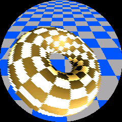
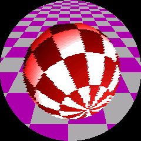

# Badge Project

A dual-target badge project featuring a circular 240x240 OLED display with GC9A01 driver on the Seeed RP2350, plus a desktop emulator for development and testing.

Ray-march based rendering of a torus which morphs to an Amiga boing ball,
initially created for the VCF West 2025 event / 40th anniversary of the Amiga.

 

## Features

- **Embedded Target**: Real badge using Seeed RP2350 with circular OLED display
- **Desktop Emulator**: SDL-based emulator with 4x chunky pixels (960x960 window)
- **Common Rendering**: Shared scanline-based renderer to avoid spurious SPI transfers
- **High Performance**: Raw SPI + DMA for efficient display updates

### Desktop Emulator

Requirements:
- CMake 3.16+
- SDL2 development libraries
- C compiler (GCC, Clang, or MSVC)

#### macOS:
```bash
# Install SDL2 with Homebrew
brew install sdl2

# Build
mkdir build-desktop && cd build-desktop
cmake .. -DBUILD_DESKTOP=ON -DBUILD_EMBEDDED=OFF
make
./badge_desktop
```

#### Linux:
```bash
# Install SDL2 (Ubuntu/Debian)
sudo apt-get install libsdl2-dev

# Build
mkdir build-desktop && cd build-desktop
cmake .. -DBUILD_DESKTOP=ON -DBUILD_EMBEDDED=OFF
make
./badge_desktop
```

### Embedded Target

Requirements:
- CMake 3.16+
- ARM GCC toolchain
- Raspberry Pi Pico SDK

#### Setup:
```bash
# Set PICO_SDK_PATH environment variable
export PICO_SDK_PATH=/path/to/pico-sdk

# Or let CMake fetch it automatically
export PICO_SDK_FETCH_FROM_GIT=1

# Build
mkdir build-embedded && cd build-embedded
cmake .. -DBUILD_EMBEDDED=ON -DBUILD_DESKTOP=OFF
make
```

This will generate `badge_embedded.uf2` which can be copied to the RP2350 in bootloader mode.

## Hardware Configuration

### Display: Seeed studio XIAO Round Display
- **Controller**: GC9A01 
- **Resolution**: 240x240 circular OLED
- **Color Format**: RGB565 (16-bit)
- **Interface**: SPI with DMA

## Rendering Architecture

The project uses a scanline-based rendering approach:

1. **Common Renderer**: Generates one scanline at a time with configurable x, y, width
2. **Embedded Path**: Writes scanlines directly to GC9A01 via SPI+DMA  
3. **Desktop Path**: Accumulates scanlines in framebuffer, then displays via SDL

This approach minimizes memory usage and allows for efficient circular clipping in the future.

## License

This project is released under the [Unlicense](https://unlicense.org/), dedicating all code and content to the public domain.
